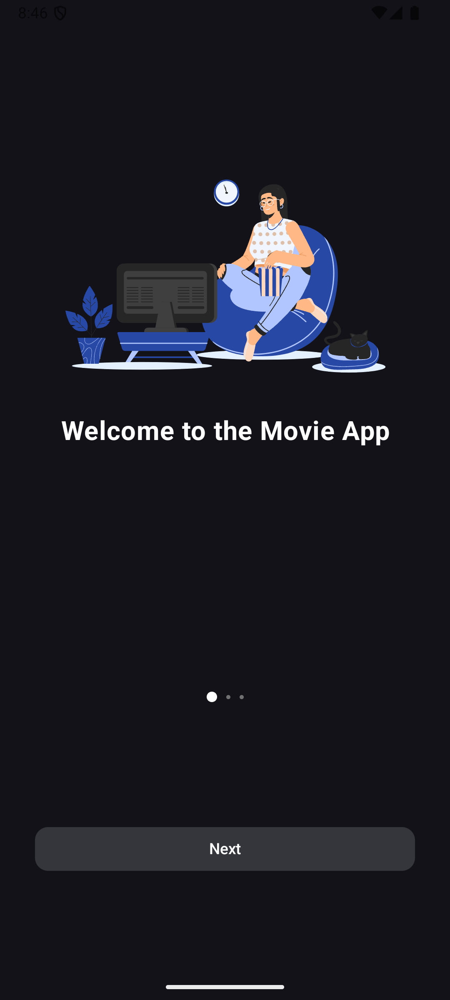
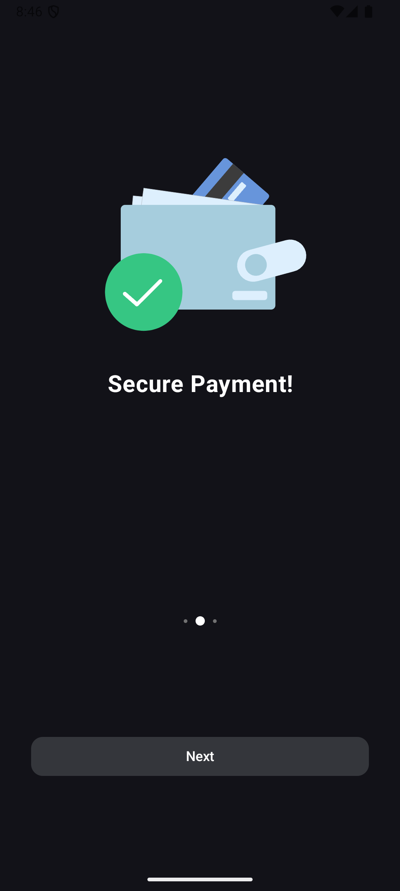
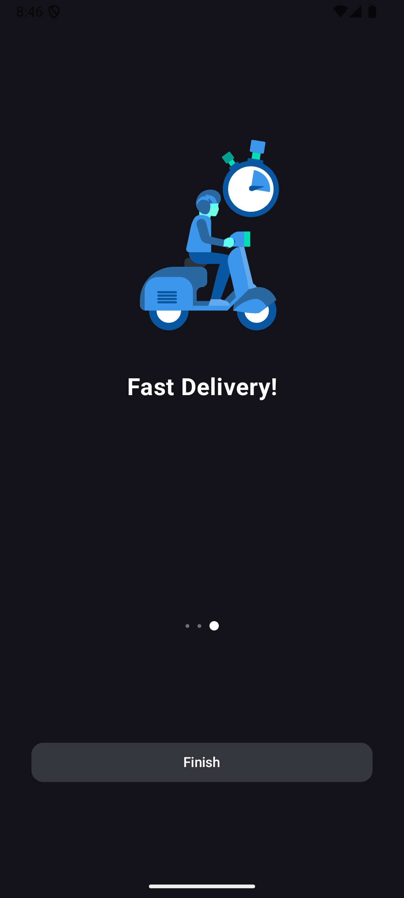
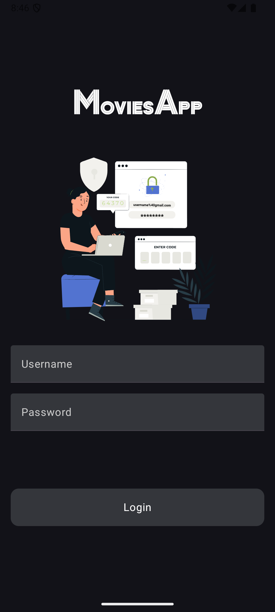
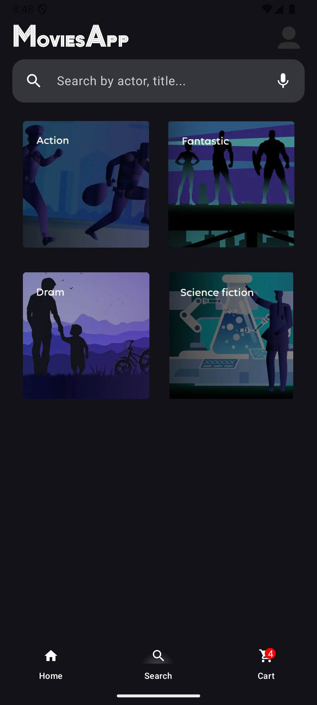
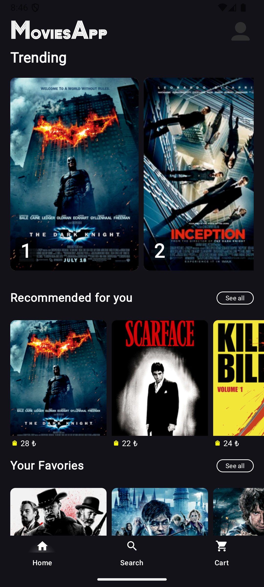
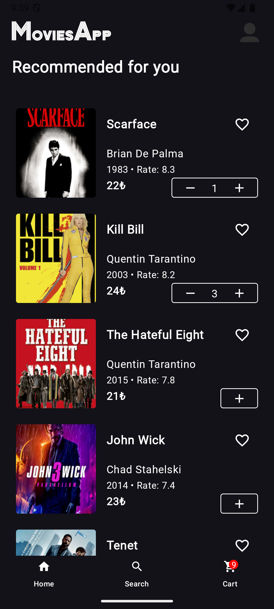
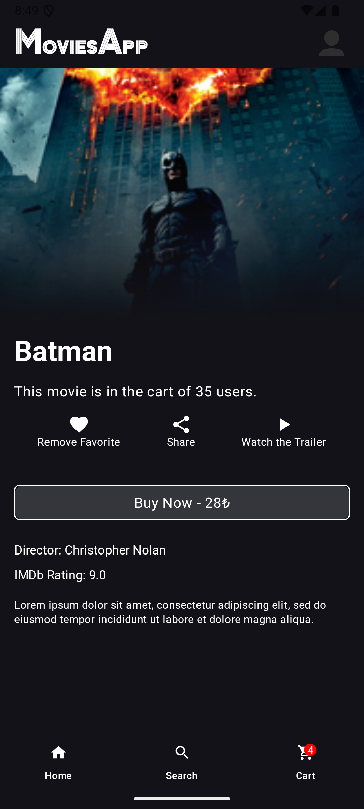
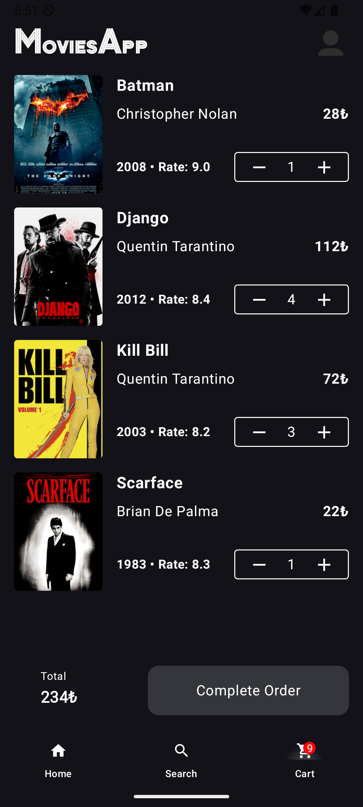
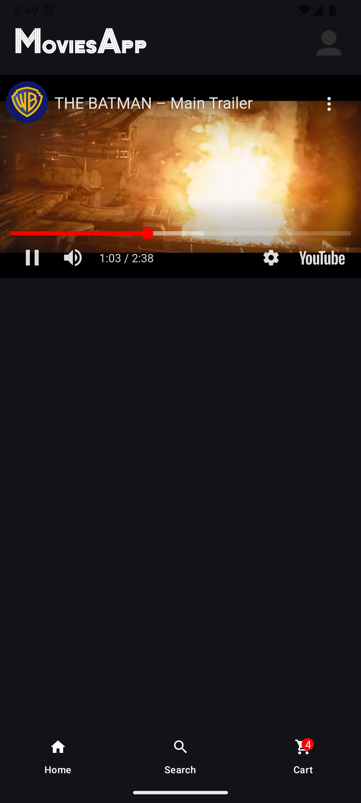

# MoviesApp 🎥📱

MoviesApp is a sleek and user-friendly Android application that allows users to explore, search, and manage their favorite movies. The app features trending movies, personalized recommendations, trailers, and cart functionality, offering a seamless movie browsing experience.

## 📸 Screenshots

|  |  |  |  |  |
|----------------------------------------------|----------------------------------------------|----------------------------------------------|--------------------------------|-----------------------------------|
| **Onboarding Step 1**                        | **Onboarding Step 2**                        | **Onboarding Step 3**                        | **Login Screen**              | **Search Screen**                 |

|  |  |  |  |  |
|-------------------------------|------------------------------------------------------|------------------------------------|-------------------------------|----------------------------------------------|
| **Home Screen**               | **Recommendations**                                  | **Movie Details**                 | **Cart Screen**              | **Trailer Playback Screen**                |

## 🚀 Features
- **Onboarding Flow**: A guided introduction to the app with Lottie animations.
- **User Authentication**: Login functionality with a responsive UI.
- **Search Functionality**: Search for movies by title, director, or voice input.
- **Movie Details**: View detailed information about movies, including trailers and user engagement stats.
- **Personalized Recommendations**: Suggested movies based on your favorites and cart items.
- **Category-Based Browsing**: Explore movies categorized by genres.
- **Add to Favorites & Cart**: Seamlessly add movies to your favorites or shopping cart.
- **Dynamic Cart Count**: Real-time updates and animations for cart items.
- **Interactive Trailers**: Watch trailers directly within the app.
- **Trending Movies**: Carousel for the highest-rated movies.
- **Responsive Design**: Adaptable for different device sizes.

## 📱 Screens

### Home Screen
- **Trending Movies**: High-rated movies in a carousel format.
- **Recommendations**: Movies tailored for you based on your preferences.
- **Categories**: Genre-based sections for easy browsing.

### Search Screen
- Search for movies using:
    - Text input
    - Voice input (powered by SpeechRecognizer)
- View search results or explore categories.

### Movie Details Screen
- View movie information:
    - Trailer, rating, director, description
    - User engagement: Number of users who have added it to their cart
- Add to favorites or cart.
- Watch trailer videos.

### Cart Screen
- View movies added to your cart.
- Modify cart items (add/remove).
- Checkout and complete the order.

### Onboarding
- Lottie-animated onboarding experience to guide new users.

## 🛠 Tech Stack
- **Programming Language**: Kotlin
- **UI Framework**: Jetpack Compose
- **State Management**: ViewModel, LiveData, StateFlow
- **Dependency Injection**: Hilt
- **Networking**: Retrofit
- **Image Loading**: Glide
- **Animations**: Lottie for onboarding and other effects.
- **YouTube Integration**: YouTubePlayer for embedded trailer playback.

## 📂 Project Structure
- **ui**: Contains all Compose screens and UI-related code (e.g., HomeScreen.kt, SearchScreen.kt, MovieDetailScreen.kt).
- **viewmodel**: Houses ViewModels for managing state and business logic (e.g., HomeViewModel, CartViewModel).
- **data**:
    - **Entity Classes**: Define movie and cart data structures.
    - **Repository**: Manages data flow between the app and the API.
- **components**: Reusable UI components like CustomBottomNavigationBar, RecommendationCard.
- **theme**: Custom themes and colors for consistent app design.

## 📦 Installation
1. Clone this repository:
   ```bash
   git clone https://github.com/yourusername/MoviesApp.git
🛡 License

This project is licensed under the MIT License.

🧑‍💻 Author
•	Alper Akaydın

Feel free to suggest additional features or report issues in the issues section. 😊

